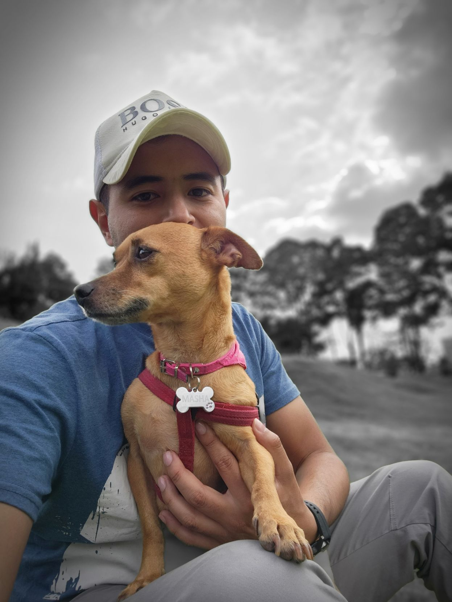
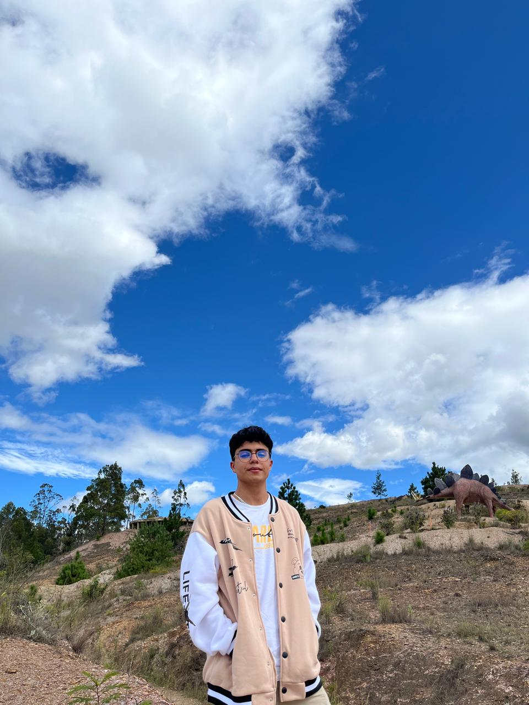
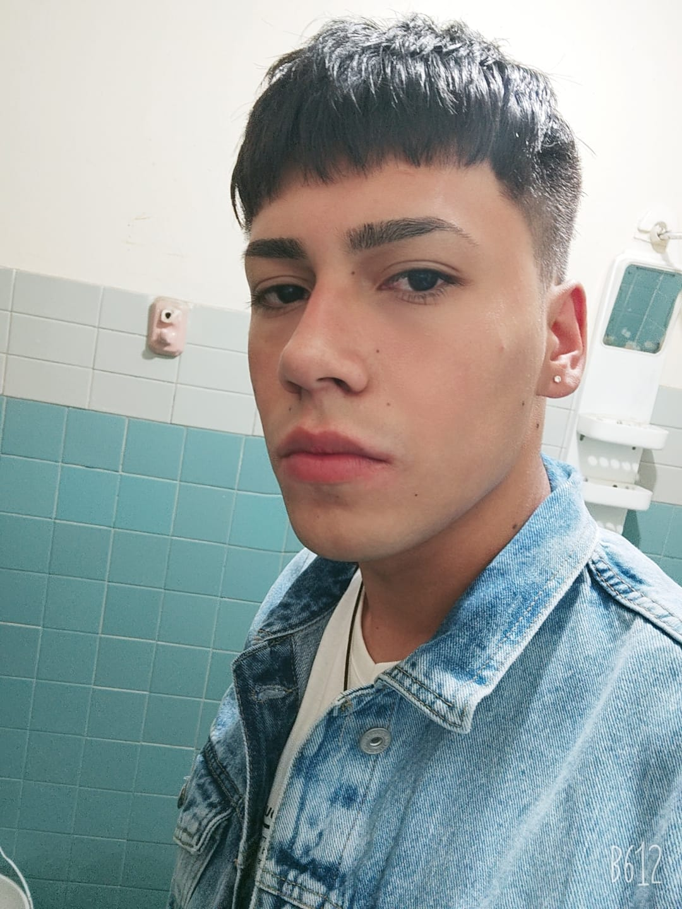
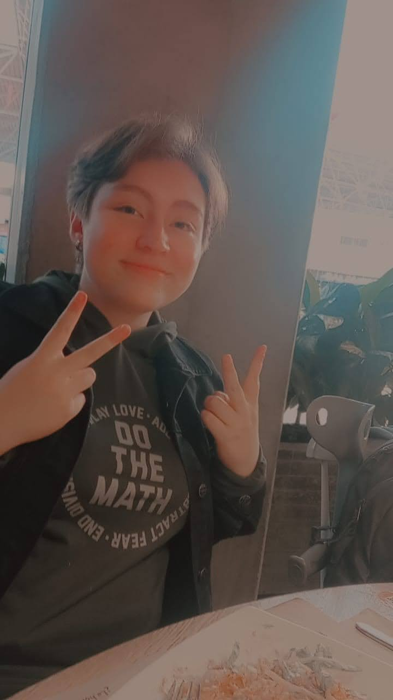

# Tiburones-Veloces

## Presentación del Equipo 

### Miembros:
#### 
**Nombre:** Rafael Galindo Galindo 
**Rol:** Ilustrador de juegos  
**Ubicación:** Bogotá,colombia  
**Perfil:** Me apasiona la creacion de videojuegos y la creación de entornos, animacion y personajes, donde puedo explotar mi creatividad y poner en marcha los conocimientos obtenidos a lo largo de mi carrera, en mis tiempos libres me gusta leer y estudiar ingles.
#### 
**Nombre:** Andres Felipe Poveda Hoyos   
**Rol:** Programador de videojuegos  
**Ubicación:** Bogotá, Colombia  
**Perfil:** Hola mi nombre es Andres Poveda, soy parte del equipo de desarrollo de este proyecto me encanta aprender sobre tecnología, musica, diseño grafico, creacion de videojuegos y el ingles. estoy dispuesto a dar mis conocimientos para tener éxito en el proyecto del equipo.
#### 
**Nombre:** Sebastian Andres Iglesias Tordecilla

**Rol:** Game Artist

**Ubicación:** Bogota, Colombia

**Perfil:** Mi nombre es Sebastián Iglesias. Me llama la atención el rol de "Game Artist" porque me apasiona la idea de dar vida a mundos y personajes a través del arte digital. Este rol me permite combinar creatividad, innovación y habilidades técnicas para transformar conceptos abstractos en experiencias visuales cautivadoras. Además, ofrece la oportunidad de especializarme en áreas como el diseño de personajes o la creación de entornos, lo que me permite desarrollar mi talento artístico mientras contribuyo al desarrollo de videojuegos que inspiran y entretienen a otros.
#### 
**Nombre:** Michel Pena

**Rol:** Diseñador de niveles   

**Ubicación:** Bogota/Colombia 

**Perfil:** Soy estudiante de ingenieria multimedia, el rol que escogí fue (diseñador de niveles), ya que he tenido creatividad e inspiración en anteriores cursos y actividades para crear ambientes propicios para un juego, ambientes que realmente puedan sumergir al jugador en la historia o modo de juego. He estado limitado por no tener un conocimiento completo en programación, he realizado proyectos en visualstudio y unity pero siento que aun me falta un poco mas para dominar bien los programas y entender bien su funcionamiento. Daré todo de mi para aportar mis conocimientos a mis compañeros y para que nuestro grupo cumpla con las metas.Estoy cursando actualmente septimo semestre y soy asesor comercial en outsourcing BPO
#### 
**Nombre:** Karoll Lizeth Gómez Torres

**Rol:** Game Designer 

**Ubicación:** Bogotá, Colombia 

**Perfil:** Soy Karoll Lizeth Gómez Torres, soy alguien a quien le gustan mucho los videojuegos y por ello es que mis expectativas con respecto a este proyecto es aprender a desenvolverme dentro de un grupo de trabajo que tiene como finalidad el desarrollo de un videojuego y adquirir experiencia de forma tanto individual como grupal a la hora de la creación de cada etapa de un proyecto de programación y diseño tan exigente como un videojuego. El rol de mi interés es el de “Game Designer” ya que me parece que este rol agrupa muchas de las cosas que le dan vida a un videojuego, lo encuentro interesante también ya que a pesar de mi poca experiencia, deseo realizar mis propios videojuegos de forma indie en algún punto de mi vida a futuro. 
